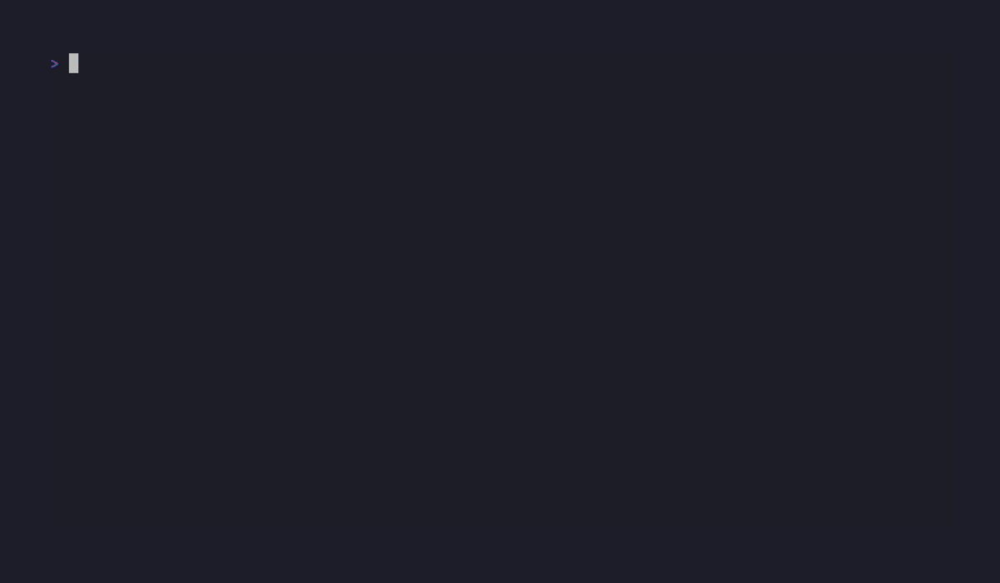

# Stack Stitcher

> A fast, keyboard-driven terminal UI for managing your self-hosted Docker Compose services.


Stack Stitcher reads a Docker **Compose** file and turns it into an interactive TUI, so you can browse and operate the services in your homelab or self-hosted stack without memorizing `docker compose` commands. It parses your `compose.yml` with the same specification library Docker itself uses, and renders everything through [Charm](https://charm.sh)'s Bubble Tea and Lip Gloss.

## Project status

Stack Stitcher is under **active development**. Compose parsing, navigation, and starting/stopping services (individually or as a whole profile) all work. Editing services, creating/deleting profiles from the TUI, and bootstrapping a compose file from scratch are still on the roadmap. Feedback, issues, and ideas are genuinely welcome and help shape where it goes next.



## Features

- **Reads standard Compose files.** Uses the official [`compose-go`](https://github.com/compose-spec/compose-go) parser, so it understands the same `compose.yml` your Docker setup already relies on — no custom config format to learn.
- **Keyboard-first TUI.** Built on [Bubble Tea](https://github.com/charmbracelet/bubbletea), [Bubbles](https://github.com/charmbracelet/bubbles), and [Lip Gloss](https://github.com/charmbracelet/lipgloss) for a responsive, styled terminal experience.
- **Start/stop a whole profile together.** Compose "profiles" group related services (e.g. everything a self-hosted app needs); Stack Stitcher lets you Start/Stop/Restart/Pull/Remove all of them in one keypress instead of remembering which services belong together.
- **Start/stop a single service.** The same five actions are available for one service at a time from the Dashboard view.

## Requirements

- **Go 1.26+** — to build from source.
- **Docker** with the Compose plugin available on your `PATH`.
- **`jq`** — used to parse `docker compose ps` output.
- A **`compose.yml`** (or `docker-compose.yml`) describing your services.

## Installation

Clone the repository and build the binary:

```bash
git clone https://github.com/filipemolina/stack-stitcher.git
cd stack-stitcher
make build
```

This produces the binary at `dist/stack-stitcher`. Move it somewhere on your `PATH` if you'd like it available everywhere:

```bash
sudo mv dist/stack-stitcher /usr/local/bin/
```

To run it during development without building:

```bash
make dev   # equivalent to: go run main.go
```

## Usage

Run Stack Stitcher from a directory that contains your Compose file:

```bash
stack-stitcher
```

It auto-detects the compose file in the current directory, checking in order: `compose.yaml`, `compose.yml`, `docker-compose.yaml`, `docker-compose.yml`. There's no flag to point at a file elsewhere yet — `cd` into the project directory first.

### Key bindings

| Key | Action | Where |
| --- | --- | --- |
| `Tab` / `Shift+Tab` | Move focus between panels | Everywhere |
| `←`/`h` `→`/`l` | Switch page | Main menu focused |
| `Space` | Select the highlighted profile or service | Profiles/Services list focused |
| `s` | Start | A profile or service panel focused |
| `t` | Stop | A profile or service panel focused |
| `r` | Restart | A profile or service panel focused |
| `p` | Pull | A profile or service panel focused |
| `x` | Remove | A profile or service panel focused |
| `q` / `Ctrl+C` | Quit | Everywhere |

Start/Stop/Restart/Pull/Remove run `docker compose` under the hood — scoped to just the selected profile (every service tagged with it) on the Home page, or to just the selected service on the Dashboard page.

## Tech stack

- **Language:** Go
- **TUI:** Bubble Tea, Bubbles, Lip Gloss (Charm)
- **Compose parsing:** `compose-spec/compose-go`
- **Docker actions:** shells out to the `docker compose` CLI (no Docker SDK dependency)

## Project layout

```
.
├── main.go            # Entry point — starts the Bubble Tea program
├── src/
│   ├── model/         # Top-level Bubble Tea model (AppModel, Update, View, Init)
│   ├── components/    # Nested Bubble Tea models — one per panel (lists, details, buttons)
│   ├── cmds/          # Message types + the tea.Cmds that produce them
│   ├── apptypes/      # Shared data types (list items, docker container, pages)
│   ├── utils/         # Non-Bubble Tea logic (compose file loading, docker exec, parsing)
│   ├── appstyles/     # Lip Gloss colors/styles
│   └── constants/     # Layout widths, branding, focusable component list
├── demo/              # VHS script + recorded demo gif
├── Makefile           # dev / build targets
├── go.mod
└── go.sum
```

## Development

```bash
make dev     # run locally
make build   # compile to dist/stack-stitcher
```

Contributions, issues, and feature ideas are welcome.

## License

Released under the [MIT License](LICENSE). © 2026 Filipe Molina.
