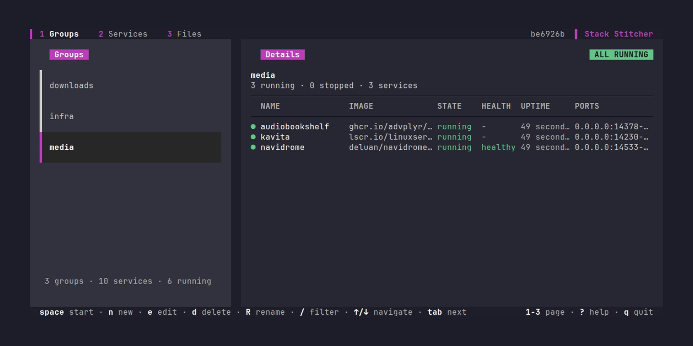
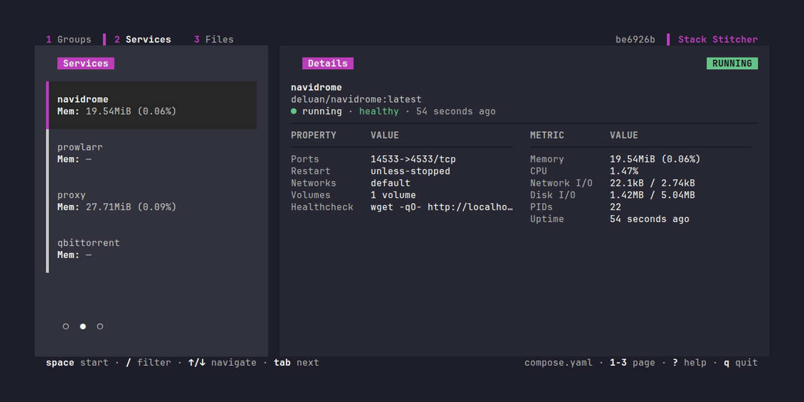
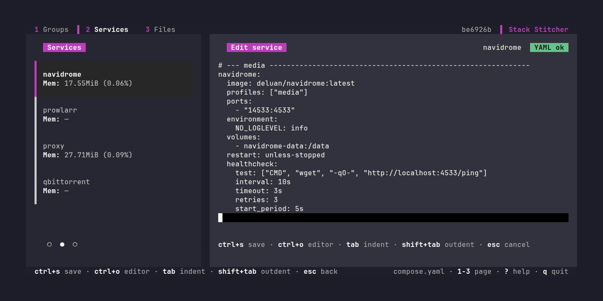
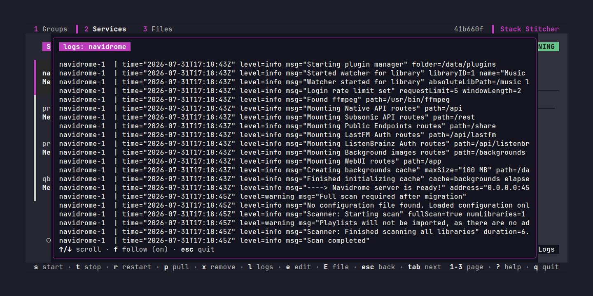
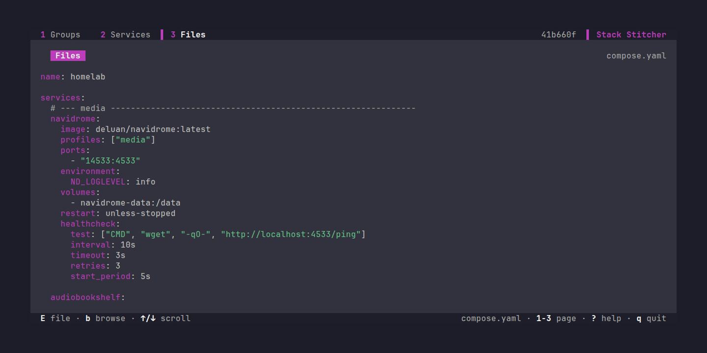
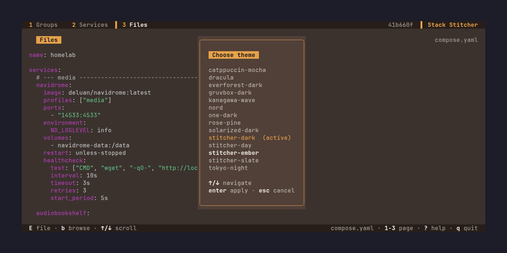

# Stack Stitcher

**Run your self-hosted stack from the terminal — without leaving your compose file behind.**

[](https://github.com/filipemolina/stack-stitcher/actions/workflows/ci.yml)


Stack Stitcher is a keyboard-driven terminal UI for a homelab that runs on
Docker Compose. It reads your `compose.yml`, groups the services the way you
already think about them, and gives you one key each for start, stop, restart,
pull, logs and edit — over SSH, with nothing extra to host, nothing listening on
a port, and no state of its own.

Your compose file stays the source of truth. Every change the TUI makes is
written back into that file, comments and key order intact, so `docker compose`
on the command line and Stack Stitcher never disagree about what your stack is.

## Why

A self-hosted stack grows into thirty services in one file, and the day-to-day
work becomes the same handful of questions. *Is the \*arr stack up? Why did
Navidrome stop? What port did I give Kavita? What breaks if I bump this image?*

Answering those from the shell means `docker compose ps`, then scrolling for the
service, then `docker compose logs -f --tail 100 sonarr`, then opening the file
in an editor to check the port you set eight months ago. Answering them from a
web GUI means running one more service, giving it the Docker socket, and
clicking through five screens — and if that GUI writes your stack, it usually
owns it, not your file.

Stack Stitcher is the third option: the file you already have, made operable.

## What it does

**Groups, not a flat list of containers.** A group is a Compose `profiles:`
tag — the \*arr stack, the media servers, the infra underneath them. Start all
four with `s`, tail all four with `l`, and see at a glance which are running,
which are healthy, and on what ports.



**Everything a self-hoster checks, on one screen.** Ports, restart policy,
networks, volumes, `depends_on`, healthcheck, PUID/PGID and image — beside live
memory, CPU, network and disk I/O for the running container.



**Edit the compose file in place, as YAML.** `e` opens the service's own
fragment in an inline editor: real YAML, not a form, so every Compose field is
reachable. It validates as you type, auto-indents on Enter, indents with
`tab`/`shift+tab`, and refuses to write a fragment that would not parse as
Compose. `ctrl+o` hands the same fragment to your `$EDITOR` if you would rather
finish there.



**Logs without leaving.** `l` streams `docker compose logs -f` for a service or
a whole group in an overlay, with follow mode and scrollback.



<details>
<summary>More screens</summary>

**The compose file itself,** syntax-highlighted and scrollable. `E` opens it in
your `$EDITOR`; `b` browses the other compose files in the same directory and
switches which one the app is driving.



**Fourteen themes,** previewed live as you move the cursor: four Stitcher
themes (one of them light) plus Catppuccin Mocha, Gruvbox Dark, Tokyo Night,
Nord, Dracula, Solarized Dark, One Dark, Everforest Dark, Rosé Pine and
Kanagawa Wave. `Enter` persists your choice.



</details>

Also: create, rename, delete groups and change which services belong to them;
confirm-guarded removes; a status re-poll every five seconds so panels reflect
changes made outside the app; and a `?` overlay listing every key, with the ones
that do nothing on the current screen dimmed.

## Where it fits

| | |
| --- | --- |
| **lazydocker, ctop** | Excellent at *what is running*. They read the daemon, not your compose file, so they cannot change it. Stack Stitcher is aimed at *what your stack is* — and writes it. |
| **Portainer, Dockge, Komodo** | Web GUIs, and capable ones. They are also a service you host, secure, update and expose. Stack Stitcher is a binary you run over SSH; nothing listens on a port. |
| **`docker compose` + `vim`** | What most of us actually do. Stack Stitcher is that, minus the remembering: which services belong together, which file is being acted on, what the flags were. |

If you already live in a terminal and your stack is one compose file you care
about, that is the gap this fills.

## Install

```bash
go install github.com/filipemolina/stack-stitcher@latest
```

Or build from source:

```bash
git clone https://github.com/filipemolina/stack-stitcher.git
cd stack-stitcher
make build     # installs to $(go env GOPATH)/bin, usually ~/go/bin
```

There are no downloadable binaries yet — the release pipeline is built (a `v*`
tag builds Linux and macOS, amd64 and arm64) but nothing is tagged, so `go
install` or a clone is the way in for now.

**Requirements:** Docker with the Compose plugin on your `PATH`, a terminal, and
Go 1.26+ to build. No Windows build — the app shells out to `docker compose` and
hands the terminal to your `$EDITOR`, and neither has been tried there.

## Use

```bash
stitch                                  # the compose file in this directory
stitch --dir ~/homelab/media            # resolve one in that directory
stitch --file ~/homelab/compose.prod.yml  # open exactly this file
```

With no flags it auto-detects `compose.yaml`, `compose.yml`,
`docker-compose.yaml`, `docker-compose.yml` — the same order Docker uses. The
file that won is named in the footer, and it is passed as `--file` to every
`docker compose` call, so the commands always act on the file the panels
describe. In a directory with no compose file at all, the app offers to write
one.

### Keys

`?` lists every key in context. The ones worth knowing:

| Key | Action |
| --- | --- |
| `1` `2` `3` | Groups / Services / Files (`[` and `]` step through them) |
| `↑` `↓` `k` `j` | Move the cursor — the details panel follows it |
| `Tab` | Move focus between the list and the details panel |
| `s` `t` `r` `p` `x` | Start · Stop · Restart · Pull · Remove (`x` confirms first) |
| `l` | Stream logs — for the service, or for every service in the group |
| `e` | Edit: a service's YAML inline, or a group's membership |
| `E` | Open the whole compose file in `$EDITOR` |
| `n` `R` `d` | New group · Rename group · Delete group |
| `/` | Filter the list by name |
| `T` `?` `a` `q` | Themes · Help · About · Quit |

Start/Stop/Restart/Pull/Remove run `docker compose` underneath — scoped to every
service in the group on the Groups page, to one service on the Services page.

Every binding is declared once, in [`src/keys/Keys.go`](src/keys/Keys.go); the
footer and the `?` overlay render from that same declaration, so they cannot
advertise a key that does nothing.

## Status

Early, and honest about it. Everything shown above works today; what follows is
what does not, in the order it is being closed — the sequence and the reasoning
live in [docs/ROADMAP.md](docs/ROADMAP.md), and each item has a full plan of its
own in [docs/plans/](docs/plans/):

- **Adding a service** needs `E` and your `$EDITOR` — the TUI can bootstrap a
  new compose file and edit existing services, but not insert a new one yet.
- **No `.env` surface.** Values are interpolated correctly; the file that holds
  them is not visible or editable in the app, and secrets are not masked.
- **No image search**, so "what is the tag for this" is still a browser tab.
- **Blank lines between services are not preserved** across a write. Comments,
  quoting and key order are. This is accepted rather than fixed: carrying blank
  lines through as marker comments was built and then removed, because a blank
  line inside a block scalar (`command: |`) is part of the string, and silently
  rewriting your data is a worse failure than losing your spacing.
- **The keybinding bar wraps** on terminals under roughly 130 columns, eating a
  row or two of the panel below it. Cosmetic, visible in the demo above, and
  first in the queue of small fixes.

Issues and ideas are genuinely welcome, and at this stage they still change the
direction.

## Built with

Go, [Bubble Tea](https://github.com/charmbracelet/bubbletea) /
[Lip Gloss](https://github.com/charmbracelet/lipgloss) for the UI, and
[compose-go](https://github.com/compose-spec/compose-go) — the same parser
Docker itself uses — for the file. Docker actions shell out to the
`docker compose` CLI rather than binding the SDK, so what the app does is what
you would have typed.

## Contributing

[CONTRIBUTING.md](CONTRIBUTING.md) has the loop, the layout, how a TUI gets
tested, and how a release is cut. [docs/DESIGN.md](docs/DESIGN.md) records *why*
things are the way they are — read it before a big change, it will save you
re-litigating decisions that were already made the hard way. If you are looking
for something to pick up, [docs/ROADMAP.md](docs/ROADMAP.md) says what is next
and why it is next.

## License

[MIT](LICENSE). © 2026 Filipe Molina.
