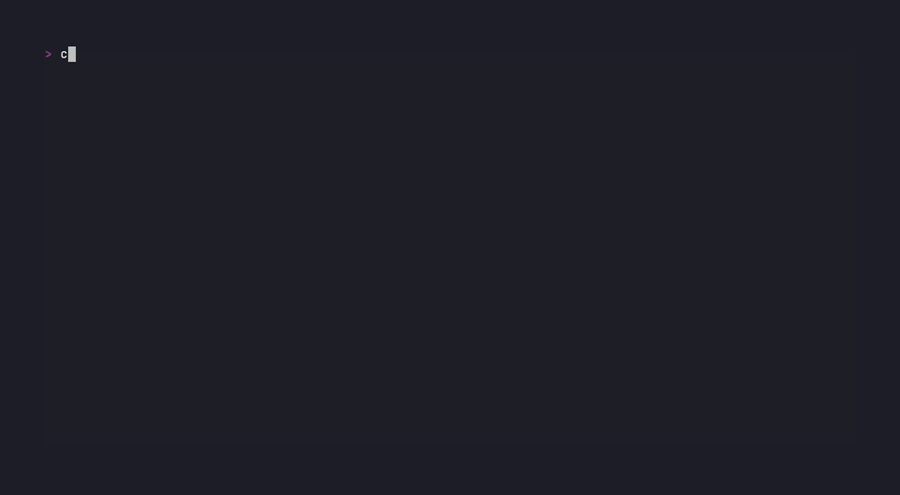

# Stack Stitcher

> A fast, keyboard-driven terminal UI for managing your self-hosted Docker Compose services.

[](https://github.com/filipemolina/stack-stitcher/actions/workflows/ci.yml)


Stack Stitcher reads a Docker **Compose** file and turns it into an interactive TUI, so you can browse and operate the services in your homelab or self-hosted stack without memorizing `docker compose` commands. It parses your `compose.yml` with the same specification library Docker itself uses, and renders everything through [Charm](https://charm.sh)'s Bubble Tea and Lip Gloss.

> **New here?** Read [docs/DESIGN.md](docs/DESIGN.md) for the guiding principles
> (groups-first navigation, group vs profile terminology, the data model).
> It will save you from re-litigating decisions that are already made.

## Project status

Stack Stitcher is under **active development**. Compose parsing, navigation, starting/stopping services (individually or as a whole group), creating/deleting groups, editing a group's membership, streaming live logs, bootstrapping a new compose file, and editing existing services all work from inside the TUI. `e` on a service opens an inline YAML editor in the details panel; `ctrl+s` saves, `ctrl+o` opens the fragment in your `$EDITOR`, and `esc` cancels. `E` still opens the whole compose file in `$EDITOR`. Inline editing works with real YAML, not a form, so every compose field is reachable and your comments, quoting and key order are kept. (Blank lines between services are not: the YAML library preserves comments but not blank lines, so any write closes the spacing up.) The Files page shows the loaded compose file with syntax highlighting and opens it in your editor; `b` browses the other compose files in its directory and switches the active one. See [TODO.md](TODO.md) for the current worklist and completed recent work, and [docs/ROADMAP.md](docs/ROADMAP.md) for the ordered plan to a first alpha. Feedback, issues, and ideas are genuinely welcome and help shape where it goes next.



## Features

- **Reads standard Compose files.** Uses the official [`compose-go`](https://github.com/compose-spec/compose-go) parser, so it understands the same `compose.yml` your Docker setup already relies on — no custom config format to learn.
- **Keyboard-first TUI.** Built on [Bubble Tea](https://github.com/charmbracelet/bubbletea), [Bubbles](https://github.com/charmbracelet/bubbles), and [Lip Gloss](https://github.com/charmbracelet/lipgloss) for a responsive, styled terminal experience.
- **Start/stop a whole group together.** Compose "profiles" group related services (e.g. everything a self-hosted app needs); Stack Stitcher lets you Start/Stop/Restart/Pull/Remove all of them in one keypress instead of remembering which services belong together.
- **Create, delete, and re-member groups from the TUI.** Make a group by naming it and picking its services, change which services belong later, or delete it — all written back to your compose file with comments and key order preserved.
- **See the file you're acting on.** The Files page shows the loaded compose file's path and its raw contents with syntax highlighting, opens it in your `$EDITOR`, and `b` browses the other compose files in its directory to switch the active one.
- **Start/stop a single service.** The same five actions are available for one service at a time from the Services page.
- **Stream live logs.** Press `l` on a focused service or group panel to open a full-screen overlay that tails `docker compose logs -f` in real time, with follow-mode and scrollback.
- **Automatically refreshed status.** Container state is rechecked every five seconds while a compose project is loaded and no modal is open, so status panels reflect changes made outside Stack Stitcher.
- **Full-height, context-aware layout.** The app fills the terminal with a pinned header (wordmark + tabs) and footer (keybinding bar); the body region stretches to use every available row. Tabs show user-facing labels such as **Groups** for Home and **Files** for Compose Files, while the underlying page IDs stay the same.

## Requirements

- **Go 1.26+** — to build from source.
- **Docker** with the Compose plugin available on your `PATH`.
- A Compose file describing your services: `compose.yaml`, `compose.yml`, `docker-compose.yaml`, or `docker-compose.yml`.

## Installation

```bash
go install github.com/filipemolina/stack-stitcher@latest
```

Or clone the repository and build the binary:

```bash
git clone https://github.com/filipemolina/stack-stitcher.git
cd stack-stitcher
make build
```

`make build` runs `go install .` with the current `git describe` stamped in, so
`stack-stitcher --version` reports the build it came from. It installs the
binary to `$(go env GOPATH)/bin` (usually `~/go/bin`). Ensure that directory is
on your `PATH`; no `sudo` or manual move is needed.

```bash
command -v stack-stitcher
```

To run it during development without building:

```bash
make dev   # equivalent to: go run main.go
```

## Usage

Run Stack Stitcher from a directory that contains your Compose file:

```bash
stack-stitcher
```

It auto-detects the compose file in the current directory, checking in order: `compose.yaml`, `compose.yml`, `docker-compose.yaml`, `docker-compose.yml` — the same order Docker itself uses. Whichever file won is named in the footer, so you can always see what you are acting on; when several of those names exist, the footer marks the winner with `+N` and the `?` overlay lists the rest. Whatever it resolves is then passed to every `docker compose` call as `--file`, so the commands act on the file the panels describe.

To work on a project somewhere else, point at it instead of `cd`-ing there:

```bash
stack-stitcher --dir ~/homelab/media      # resolve a compose file in that directory
stack-stitcher --file ~/homelab/media/compose.prod.yaml   # open exactly this file
```

`-d` and `-f` are the short forms. `--dir` resolves in the usual order; `--file` opens the file you name, whatever it is called. They can't be combined — either one on its own already does the job. A path that doesn't exist is reported before the UI starts, not inside it.

```bash
stack-stitcher --version   # the release it was built from, or the commit
stack-stitcher --help
```

### Key bindings

Pages are switched with the digit shown on each nav tab — `1` Groups, `2`
Services, `3` Files — or with `[` and `]` to step through them. `Alt` plus the
tab's first letter still works as an alias for terminals that send Option as
Alt (macOS Terminal.app and iTerm2 do not, unless you change a setting). The
nav itself never takes keyboard focus, so `Tab` is free to move between the
two body panels.

| Key | Action | Where |
| --- | --- | --- |
| `1`–`3` | Jump to Groups / Services / Files | Everywhere |
| `[` / `]` | Step to the previous / next page | Everywhere |
| `Tab` / `Shift+Tab` | Move focus between the two body panels | Everywhere |
| `Esc` | Back to the list panel | Details panel focused |
| `Space` / `Enter` | Select the highlighted group or service | Groups/Services list focused |
| `s` | Start | A group or service panel focused |
| `t` | Stop | A group or service panel focused |
| `r` | Restart | A group or service panel focused |
| `p` | Pull | A group or service panel focused |
| `x` | Remove (asks for confirmation) | A group or service panel focused |
| `n` | Create a new group | Groups panel focused |
| `e` | Edit the highlighted group's membership | Groups panel focused |
| `d` | Delete the highlighted group | Groups panel focused |
| `e` | Edit the service's YAML inline in the details panel | Service details panel focused |
| `ctrl+s` | Save the inline edit | Inline editor open |
| `ctrl+o` | Open the current inline fragment in `$EDITOR` | Inline editor open |
| `esc` | Cancel the inline edit (confirms if changed) | Inline editor open |
| `E` | Edit the whole compose file in `$EDITOR` | Service details panel or Files page focused |
| `b` | Browse and switch compose files | Files page focused |
| `↑`/`↓` `k`/`j` `PgUp`/`PgDn` | Scroll the compose file | Files page focused |
| `l` | View live logs (streaming overlay) | A group or service panel focused |
| `↑`/`↓` `k`/`j` | Move the cursor | Groups/Services list focused |
| `g` / `G` | Jump to the first / last row | Groups/Services list focused |
| `/` | Filter the list by name | Groups/Services list focused |
| `Enter` / `Esc` | Apply / abandon the filter you are typing | Filtering a list |
| `Esc` | Clear an applied filter | A filtered list focused |
| `f` | Toggle follow (auto-scroll) | Logs overlay open |
| `↑`/`↓` `PgUp`/`PgDn` | Scroll logs | Logs overlay open |
| `Esc` | Close the logs overlay | Logs overlay open |
| `?` | Help overlay: every key, unavailable ones dimmed | Everywhere except while typing |
| `a` | About: version, license, repo link | Everywhere except while typing |
| `q` | Quit | Everywhere except while typing |
| `Ctrl+C` | Quit, whatever is on screen | Everywhere |
| `Enter` | Confirm | Any modal |
| `Esc` | Cancel / close | Any modal |
| `y` / `n` | Answer a confirmation | Confirmation modal open |
| `Space` | Toggle the highlighted service | Service checklist modal open |

Start/Stop/Restart/Pull/Remove run `docker compose` under the hood — scoped to the selected group (every service tagged with it) on the Home page, or to just the selected service on the Services page.

Every binding above is declared once, in [`src/keys/Keys.go`](src/keys/Keys.go).
The panels match against it, and the footer bar and the `?` help overlay render
from it, so changing a key there changes it everywhere and both follow. The
overlay also lists the keys the footer has no room for (`Alt`+letter page
aliases, `g`/`G`, `Shift+Tab`, `Ctrl+C`, and `a` for About). If you are adding a key, that's the
file — see [docs/DESIGN.md](docs/DESIGN.md) for the tiers and the rules they
follow.

While you are typing a filter or editing a service inline, the component has the
whole keyboard, so `n`, `d`, `q` and the page digits are letters rather than
commands; `Enter` applies the filter and `Esc` abandons it. `Ctrl+C` is the
exception that always quits, whatever is on screen.

### UI overview

Stack Stitcher fills the terminal. The top bar shows the `▌ Stack Stitcher` wordmark and page tabs; the body stretches to use all remaining rows, and the keybinding bar at the bottom is context-aware (action hints are hidden until a group or service is selected). The bar also names the compose file in use, dimmed on the right next to the global keys, shortening it and then dropping it as the terminal narrows.

On **Home** the body is a two-pane layout: the Groups list on the left and the Group Details panel on the right. The Group Details panel no longer renders the large ASCII logo. Instead it shows:

- **No groups yet:** a *Getting started* card explaining that groups are Compose profiles and how to create one.
- **Groups exist, none selected:** a *Select a group* card prompting the user to pick from the list.
- **Group selected:** a header card with the group name, a status pill (ALL RUNNING / MIXED / STOPPED), and a running/stopped/services summary, followed by a member-services table (status dot, NAME, IMAGE, STATE, HEALTH, UPTIME, PORTS). When nothing is running a "Press `s` to start." footnote appears, and Start/Stop/Restart/Pull/Remove action buttons are pinned at the bottom.

On **Files** the body is a single panel showing the loaded compose file's path and its raw contents with syntax highlighting, which you can scroll and open in your `$EDITOR` with `E`. `b` opens a picker listing the other compose files in the same directory so you can switch the active one.

The ASCII logo lives in `src/constants/Branding.go` and is shown by the About modal (`a`).

## Tech stack

- **Language:** Go
- **TUI:** Bubble Tea, Bubbles, Lip Gloss (Charm)
- **Compose parsing:** `compose-spec/compose-go`
- **Docker actions:** shells out to the `docker compose` CLI (no Docker SDK dependency)

## Project layout

```
.
├── main.go            # Entry point — starts the Bubble Tea program
├── src/
│   ├── model/         # Top-level Bubble Tea model (AppModel, Update, View, Init)
│   ├── components/    # Nested Bubble Tea models — one per panel (lists, details, buttons)
│   ├── cmds/          # Message types + the tea.Cmds that produce them
│   ├── apptypes/      # Shared data types (list items, docker container, pages)
│   ├── keys/          # Every keybinding, declared once — components, the footer, and the ? overlay all read it
│   ├── utils/         # Non-Bubble Tea logic (compose file loading, docker exec, parsing)
│   ├── appstyles/     # Lip Gloss colors/styles
│   ├── highlight/     # Read-only YAML syntax highlighting for the Files page viewer
│   └── constants/     # Layout widths, branding, focusable component list
├── demo/              # VHS script + recorded demo gif
├── docs/              # DESIGN.md (why), ROADMAP.md (what's next), historical specs & plans
├── .github/workflows/ # CI on every push and PR, releases on a v* tag
├── .goreleaser.yaml   # what a tagged release builds
├── CONTRIBUTING.md    # the loop, how to test a TUI, how a release is cut
├── TODO.md            # current worklist and completed recent work
├── Makefile           # dev / build targets
├── go.mod
└── go.sum
```

## Development

```bash
make dev           # run locally
make build         # install to $(go env GOPATH)/bin

go build ./...     # compile every package
go vet ./...       # static checks
go test ./...      # test suite
gofmt -l .         # must print nothing
```

CI runs all four on every push and pull request, with `go test -race`.

Contributions, issues, and feature ideas are welcome — see
[CONTRIBUTING.md](CONTRIBUTING.md).

## License

Released under the [MIT License](LICENSE). © 2026 Filipe Molina.
